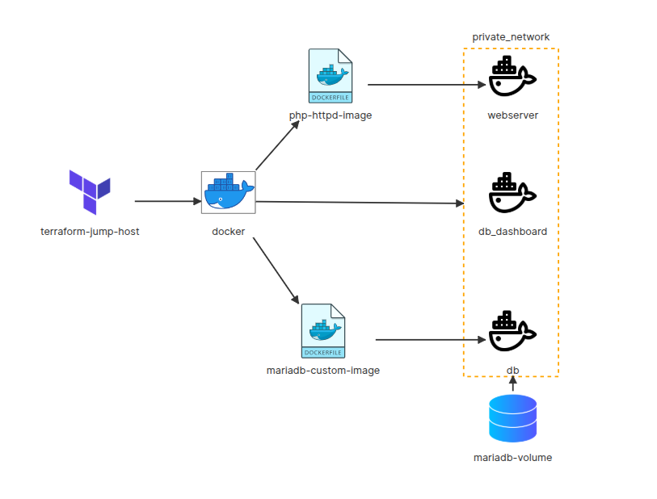

# 🧪 Terraform & Docker Lab



## 📌 Lab Objective

This lab demonstrates how to use **Terraform as a jump host** to provision and orchestrate a **local Docker infrastructure** composed of multiple containers connected through a **private Docker network**.

The infrastructure includes:
- A **PHP + Apache** image for the web server
- A **custom MariaDB** image for the database
- A **db_dashboard** container (e.g. phpMyAdmin)
- A **persistent volume** for MariaDB data
- A **private Docker network** for service isolation

Terraform is used as an **Infrastructure as Code (IaC)** tool to ensure reproducibility and automated deployments.

---

## 🏗️ Architecture Overview

### 1️⃣ Terraform Jump Host

- Terraform is executed from a machine called **terraform-jump-host**
- This machine:
  - Has Terraform installed
  - Has Docker installed
  - Manages the infrastructure using the **Docker provider**

Terraform acts as an **orchestrator**, not as an application runtime.

---

### 2️⃣ Docker Engine

Terraform interacts with the **local Docker daemon** to:
- Build Docker images from Dockerfiles
- Create Docker networks
- Launch containers
- Attach persistent volumes

---

### 3️⃣ Docker Images

#### 🐘 php-httpd-image

- Built from a **PHP + Apache Dockerfile**
- Used by:
  - The **webserver** container
  - The **db_dashboard** container

This image provides:
- PHP
- Apache
- Required extensions to communicate with MariaDB

---

#### 🐬 mariadb-custom-image

- Custom MariaDB image
- Built using a Dockerfile
- Used for the **db** container

It enables:
- Controlled configuration
- Database initialization
- Persistent data storage

---

### 4️⃣ Private Docker Network (`private_network`)

All application containers are connected to a **private Docker network**:

- 🔒 Network isolation
- 🔁 Internal communication via container names
- ❌ No unnecessary exposure to the host

Containers in this network:
- `webserver`
- `db_dashboard`
- `db`

---

### 5️⃣ Containers

#### 🌐 webserver

- Based on `php-httpd-image`
- Hosts the web application
- Communicates with the database through the private network

---

#### 📊 db_dashboard

- Based on `php-httpd-image`
- Provides a database management interface (e.g. phpMyAdmin)
- Accesses the `db` service via the private network

---

#### 🗄️ db (MariaDB)

- Based on `mariadb-custom-image`
- Stores data persistently
- Accessible **only from the private network**

---

### 6️⃣ MariaDB Volume

#### 💾 mariadb-volume

- Docker volume attached to the `db` container
- Enables:
  - Data persistence
  - Container recreation without data loss

---

## 🔄 Workflow

1. Terraform reads the `.tf` files
2. Terraform:
   - Creates the private Docker network
   - Builds Docker images
   - Creates the MariaDB volume
   - Starts the containers
3. Containers communicate only through the private network
4. MariaDB data is stored in a persistent volume

---


## 🚀 Main Commands

```bash
terraform init
terraform plan
terraform apply

